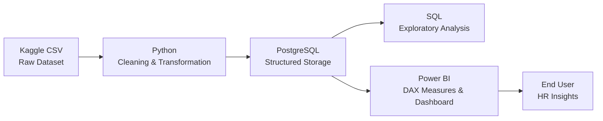
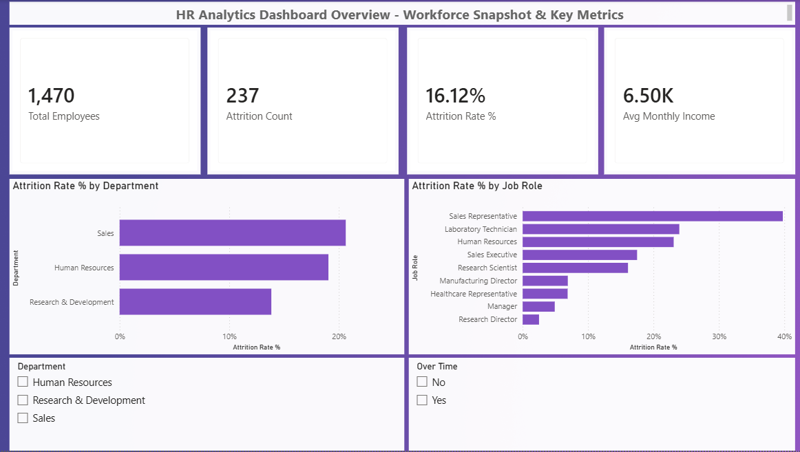
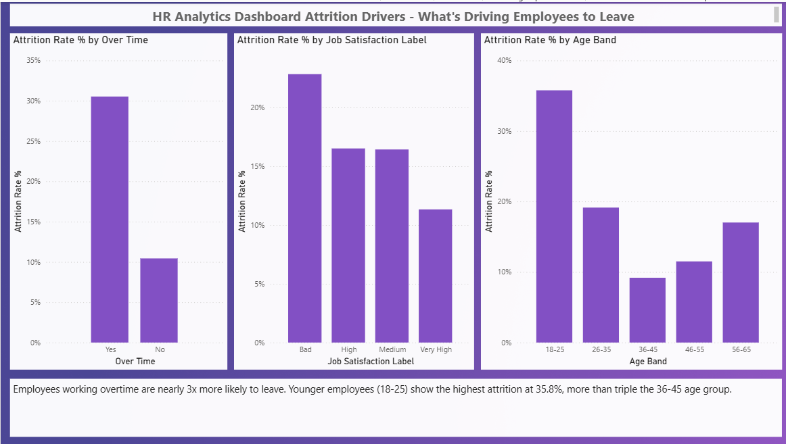
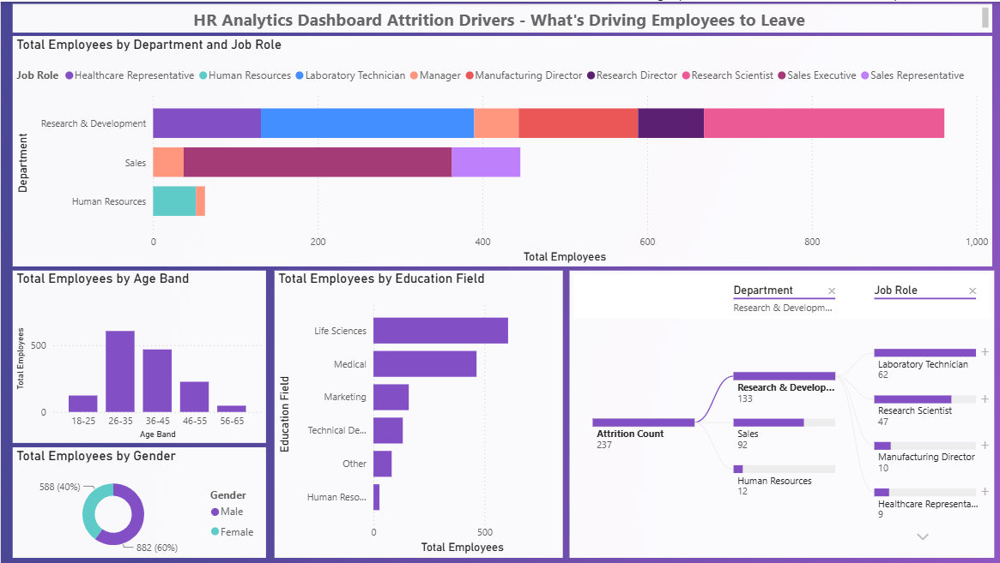

# 📊 HR Analytics Dashboard - Employee Attrition Analysis


[](https://www.microsoft.com/en-us/microsoft-365/excel)
[](https://learn.microsoft.com/en-us/dax/)
[]()


An end-to-end data analytics project exploring employee attrition patterns using Python, PostgreSQL, and Power BI. The pipeline takes a raw HR dataset from cleaning through modeling to an interactive, multi-page dashboard that surfaces the key drivers behind why employees leave.

---

## 🎯 Project Overview
 
Employee attrition is costly and often preventable if the right patterns are understood early. This project analyzes 1,470 employee records to answer:
 
* What is the overall attrition rate, and how does it vary by department and job role?
* What factors most strongly predict whether an employee leaves: overtime, job satisfaction, age, tenure?
* Where should HR focus retention efforts first?

---

## 🛠️ Tech Stack
 
* Data Cleaning and Transformation: Python (pandas)
* Data Storage: PostgreSQL
* Querying and Analysis: SQL
* Visualization: Power BI (DAX)

---

## 🔑 Key Findings
 
* Overall attrition rate: 16.12% (237 of 1,470 employees)
* Overtime is the strongest driver: employees working overtime leave at 30.5%, nearly 3x the rate of those who don't (10.4%)
* Sales Representative has the highest attrition by job role at 39.8%, compared to just 2.5% for Research Directors
* Younger employees (18 to 25) leave at 35.8%, more than triple the rate of the 36 to 45 age group (9.2%)
* Job satisfaction shows a clear gradient: attrition drops steadily from "Bad" (22.8%) to "Very High" (11.3%) satisfaction
* Employees who leave earn less on average in every department and have fewer years since their last promotion

---

## 📁 Project Structure
 
```
HR-Analytics-Dashboard/
│
├── data/
│   ├── raw/                            Original Kaggle dataset (not redistributed, see Dataset section)
│   └── processed/                      Cleaned dataset after Python processing
│
├── python/
│   ├── 02_cleaning.py                  Cleans raw data, adds labels & derived bands
│   └── 03_load_to_postgres.py          Loads cleaned data into PostgreSQL
│
├── sql/
│   ├── create_tables.sql               Database schema
│   └── analysis_queries.sql            Exploratory attrition analysis queries
│
├── powerbi/
│   └── HR-Analytics-Dashboard.pbix     Main Power BI report (3 pages)
│
├── docs/
│   └── screenshots/                    Dashboard page screenshots
│
└── README.md
```

---

## 🏗️ Architecture
 

 
The pipeline moves data through four stages: raw ingestion, Python-based cleaning, PostgreSQL storage, and Power BI visualization, with SQL used in parallel for exploratory validation before building the dashboard.

---

## 📈 Dashboard Pages
 
### 1. Overview
Headcount, attrition rate, average income KPIs; attrition rate by department and job role.
 

 
### 2. Attrition Drivers
Attrition by overtime, job satisfaction, and age band, with written insights.
 

 
### 3. Demographics
Headcount by department/role, age distribution, gender split, education field breakdown, plus an interactive decomposition tree.
 


---


## 📂 Dataset
 
This project uses the **IBM HR Analytics Employee Attrition & Performance** dataset (1,470 rows, 35 columns), available on [Kaggle](https://www.kaggle.com/datasets/pavansubhasht/ibm-hr-analytics-attrition-dataset).
 
The raw file isn't redistributed in this repo - download it directly from Kaggle and place it in `data/raw/` to reproduce the pipeline.

---

## ▶️ How to Run
 
1. **Download the dataset** from Kaggle (link above) into `data/raw/`
2. **Clean the data**:
```bash
   cd python
   pip install pandas
   python 02_cleaning.py
```
3. **Set up PostgreSQL**:
   - Create a database named `hr_analytics`
   - Run `sql/create_tables.sql` to create the schema
4. **Load the cleaned data**:
```bash
   pip install sqlalchemy psycopg2-binary
   python 03_load_to_postgres.py
```
   (update the `DB_CONFIG` credentials in the script first)
5. **Explore with SQL** (optional): run `sql/analysis_queries.sql` against the database
6. **Open the dashboard**: launch `powerbi/HR-Analytics-Dashboard.pbix` in Power BI Desktop, and point the PostgreSQL connection to your local database

---

👤 **Dunith Desitha Athukorala**
